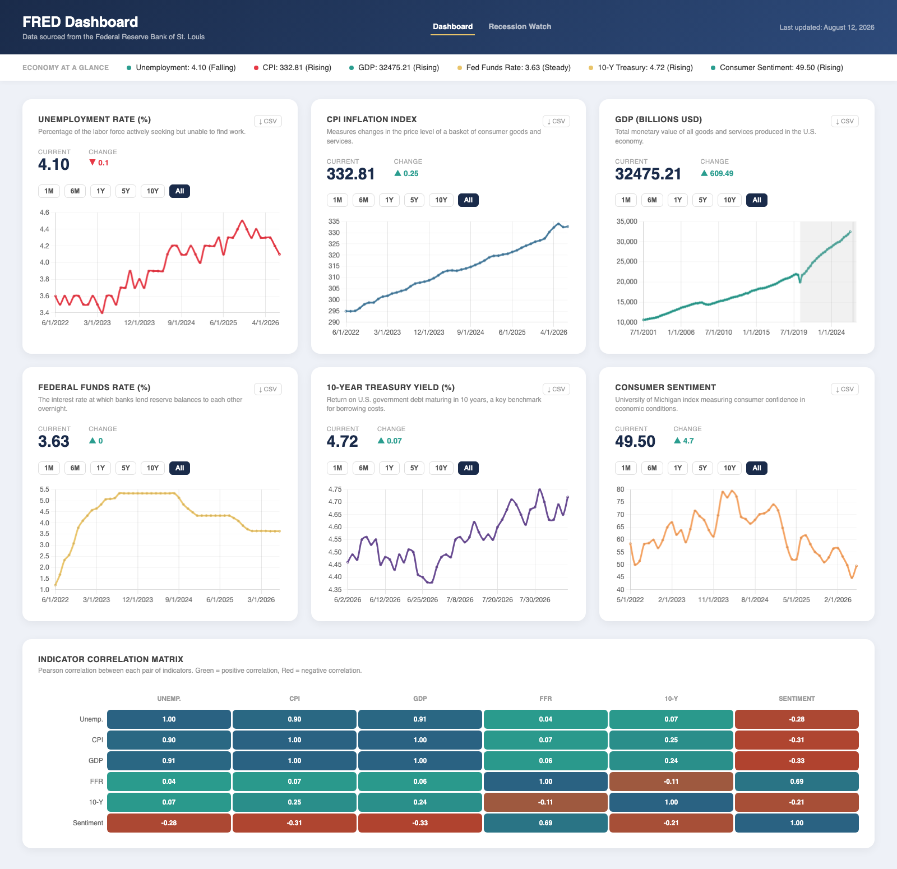
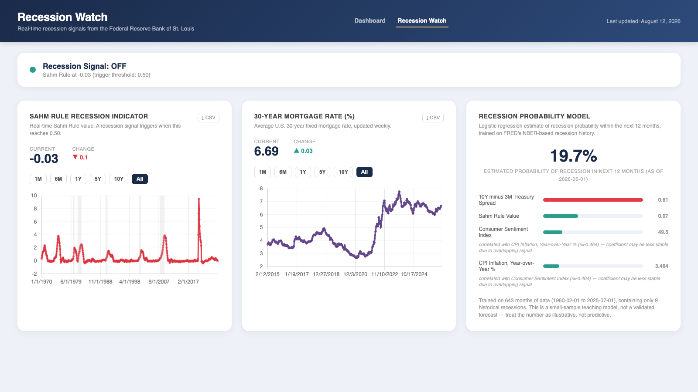

# FRED Economic Dashboard

A two-page dashboard for U.S. macroeconomic indicators, pulled live from the Federal Reserve Economic Data (FRED) API.

**Live:** https://fred-dashboard-5txq.onrender.com/



## What it does

**Dashboard** (`/`) — six series, each with its own chart: unemployment, inflation, GDP, the federal funds rate, the 10-year Treasury yield, and consumer sentiment.

- Interactive time-series charts with NBER recession periods shaded
- Date range filtering
- CSV export of the underlying observations
- A 6x6 correlation heatmap across all indicators
- Mobile responsive

**Recession Watch** (`/recession-watch`) — a second page built around three signals: the Sahm Rule real-time recession indicator, the 30-year mortgage rate, and a logistic regression model estimating recession probability over the next 12 months. A verdict banner reads the Sahm Rule's latest value against its 0.50 recession-trigger threshold and shows a plain ON/OFF signal; the mortgage rate is shown as its own independent chart, not folded into that verdict; the probability model is a separate card with a full coefficient breakdown of what's driving its estimate.



## Stack

Python, Flask, and Jinja templates with Chart.js for the charts. No frontend build step and no database. Deployed on Render, served by gunicorn via a Procfile. pandas/numpy/scikit-learn power the recession probability model described below.

`templates/base.html` holds the shared layout (head, nav, header) that both pages extend; shared CSS and JS live in `static/` and are loaded once from there rather than duplicated per page.

## How it works

The backend is a thin aggregator over the FRED API rather than a data store. A single `get_fred_data` function calls FRED's observations endpoint and reshapes the response; eight routes wrap the eight series (six dashboard indicators plus the Sahm Rule and mortgage rate for Recession Watch). Everything is fetched live on page load.

### Parallel fetching for the heatmap

The `/api/all` endpoint feeds the correlation heatmap and needs all six series at once. It originally fetched them sequentially, so the wall-clock load time was the sum of six network round trips. Since the calls are blocking I/O rather than CPU work, a `ThreadPoolExecutor` lets the waits overlap instead of stacking, which cut load time substantially for no added complexity.

### Aligning series that report at different frequencies

This was the actual problem in building the heatmap. The six series report on different schedules: some daily, some monthly, GDP quarterly. Pearson correlation needs paired observations, and these series do not line up on their own.

The heatmap is computed client-side after `/api/all` returns. It builds a lookup per series, aligns them by nearest-date matching, then computes Pearson correlation for all 36 pairs and colors each cell by interpolating an RGB range.

Nearest-date matching is an approximation, and worth naming as one. It does not forward-fill, does not account for the lag between a quarterly figure and the monthly data it is matched against, and produces no confidence bounds on the coefficients. The heatmap is meant to surface rough co-movement between indicators, not to support inference.

### A bug worth documenting

GDP loaded slowly and returned less history than the other series. Two unrelated causes, which is why it took a while to find:

1. The fetch had no timeout, so a slow FRED response blocked the request instead of failing fast.
2. GDP was requested at the same observation limit as the monthly series. Because GDP is quarterly, an identical limit buys roughly a third as many years of history.

Fixed by adding a timeout and raising GDP's observation limit specifically.

### Recession probability model

`recession_model.py` fits a logistic regression on FRED's own monthly `USREC` recession flag, predicting the probability that a recession starts within the next 12 months from four features: the 10Y-3M Treasury yield spread, the Sahm Rule value, consumer sentiment, and CPI inflation (year-over-year). Logistic regression was chosen specifically over a more accurate but opaque model (e.g. gradient boosting) because its coefficients are directly readable — each one says, in effect, "when this feature is above its historical average, estimated recession probability moves up or down by this much" — which is what powers the per-feature breakdown on the Recession Watch card.

Two things surfaced while building it that are worth naming rather than hiding:

- **Collinearity distorts individual coefficients.** An unemployment-rate-change feature was dropped entirely because it was 84% correlated with the Sahm Rule (both are built from similar unemployment dynamics), which made one of their coefficients flip to a sign that looked backwards when both were in the model together, despite each being correctly signed on its own. A second, milder case of the same thing (consumer sentiment, correlated with CPI at -0.46) was kept rather than removed — economic indicators are inherently correlated with each other, so the API response and UI surface a `correlation_note` on any feature whose coefficient may be distorted this way, rather than pretending the four features are independent.
- **No accuracy or AUC score is reported.** The training window has ~9 recession episodes. That's enough months of data, but very few independent *events* — months within one recession are highly correlated with each other, not 9 separate data points. Any train/test split small enough to leave meaningful data to train on would produce an accuracy number driven by which handful of months happened to land in the test set, which is false precision, not real confidence. The model is fit on the full history and left at that.

The model trains once, lazily, on first request, and is cached in memory for the process's lifetime — not on a timer and not on every request. The underlying FRED series update at most monthly, and with so few recession episodes to learn from, one more month of ordinary data barely moves the fit; a new fit only happens when the server process restarts.

## Known limitations

Kept deliberately visible rather than papered over:

- **No caching or rate limiting.** Every page load hits FRED live.
- **Redundant fetches.** The six chart endpoints and `/api/all` request the same six series, roughly doubling FRED calls per load. Known, unaddressed.
- **Recession shading is hardcoded** from NBER dates rather than pulled from a source, so it needs a manual update when NBER announces a new cycle.
- **Correlation alignment is approximate**, as described above.
- **Sahm Rule can lag by a month or two.** FRED marks the most recent observations as `.` until they're finalized; the client filters those out, so the Recession Watch verdict may reflect a slightly older month than the calendar-current one.
- **Recession probability model is trained on a small number of historical recessions (single digits) with no held-out test set** — treat it as illustrative/educational, not a validated forecast.
- **No automated tests.**

## Running locally

```bash
git clone https://github.com/Elliot-Daschner/fred-dashboard.git
cd fred-dashboard
python -m venv venv && source venv/bin/activate   # Windows: venv\Scripts\activate
pip install -r requirements.txt
```

Get a free API key from https://fredaccount.stlouisfed.org/apikeys and put it in a `.env` file in the project root:

```
FRED_API_KEY=your_key_here
```

The key is loaded with python-dotenv and is never committed.

```bash
python app.py
```

Then open http://localhost:5000 for the dashboard, or http://localhost:5000/recession-watch for Recession Watch.

## Possible next steps

- Cache FRED responses so repeat loads do not refetch identical data
- Serve the charts and the heatmap from one request instead of two
- Replace nearest-date matching with proper resampling before computing correlations
- Add tests around the data-reshaping layer
